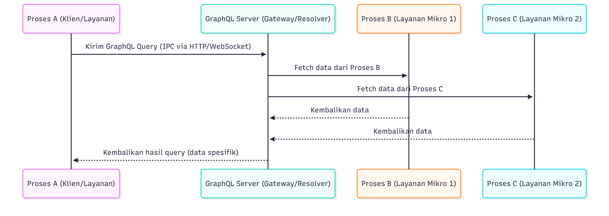

## UTS Sistem Terdistribusi dan Terdesentralisasi

###### Nama : Ikhsan Maulana A 
###### NIM  : 245410090

## 1. Teorema CAP dan BASE serta keterkaitannya
## Theorema CAP

| Komponen      | Penjelasan    |
| ------------- |:-------------:|
| C-Consistency | Setiap operasi baca mengembalikan penulisan terbaru, memastikan semua klien memiliki tampilan data yang sama.       |
| A – Availability | Setiap permintaan menerima respons meskipun bukan data terbaru.     |
| P – Partition Tolerance      | Sistem tetap beroperasi dan berfungsi meskipun komunikasi antar node terputus atau terfragmentasi.     |

Theorema CAP benar karena dalam partisi jaringan, Sistem terdistribusi harus memilih antara (1)
menjamin tampilan data yang konsisten
(consistency) atau (2) memastikan setiap
permintaan menerima respons (availability).
* Jika memilih consistency, sistem harus menolak
permintaan ke node yang terisolasi,
mengorbankan availability.
* Jika memilih availability, sistem memungkinkan
data yang berpotensi berbeda untuk dibaca dari
node yang terisolasi, mengorbankan consistency.

**Prinsip Base** muncul dari dunia NoSQL sebagai pendekatan longgar terhadap konsistensi. BASE adalah kebalikan dari ACID di database relasional.

## Prinsip BASE

| Komponen  | Penjelasan |
| ------------- |:-------------:|
| Basically Available      | Sistem selalu berusaha merespon walaupun tidak sempurna.     |Sistem selalu berusaha merespon walaupun tidak sempurna.
| Soft-state      | Data tidak harus sinkron setiap saat; bisa berubah seiring waktu.     |
| Eventually consistent      | Data akhirnya akan konsisten, tapi tidak saat itu juga.     

## Keterkaitan CAP dan BASE
| Konsep  |CAP| BASE | Penjelasan| 
|:-------------:|:-----:|:-------------:|:-----:|
| Pilihan Dasar|Availability (A) dan Partition Tolerance (P)|Basically Available (BA)|Sistem memprioritaskan untuk selalu aktif dan dapat diakses oleh pengguna, bahkan saat terjadi kegagalan jaringan (P). Inilah inti dari BA (Ketersediaan Dasar).
| Konsistensi|Mengorbankan Consistency (C) yang ketat|Eventually Consistent (EC)|Karena A diprioritaskan, C (konsistensi seketika) harus dikorbankan. Sistem menerima data yang mungkin inkonsisten untuk sementara. Data akan disinkronkan dan konsisten pada akhirnya (EC).

## Contoh : Penghitung Jumlah Like di Media Sosial (Memilih AP / Filosofi BASE)
**Konteks**

Ketika pengguna menekan tombol "Suka" (Like) pada sebuah postingan, like tersebut harus dicatat, dan pengguna lain harus segera melihat postingan itu, meskipun jumlah like yang dilihat di berbagai wilayah dunia mungkin berbeda sesaat.

|Properti CAP|Penerapan|Pilihan|
| ------------- |:-------------:|:---:|
|Availability (A)|Sangat penting. Pengguna harus selalu dapat like dan melihat feed.|Dipertahankan|
|Partition Tolerance (P)|Penting. Jaringan global pasti mengalami partisi.|Dipertahankan|
|Consistency (C)|Dikorbankan|Dikorbankan|

**Filosofi BASE yang Terlibat**

1. Basically Available (BA): Sistem menerima like dari pengguna, bahkan jika server yang memprosesnya tidak dapat berkomunikasi dengan server lain. Aplikasi tidak akan crash.

2. Soft State (SS): Jumlah like di server Indonesia mungkin 10, sementara di server Eropa masih 9. Keadaan ini bersifat lunak dan sementara.

3. Eventually Consistent (EC): Setelah jaringan pulih atau mekanisme sinkronisasi latar belakang berjalan, server akan bertukar data. Akhirnya, semua server akan mencatat jumlah like yang sama (misalnya, 10).

## 2. Keterkaitan antara GraphQL dengan komunikasi antar proses pada sistem terdistribusi
Keterkaitannya ada pada cara GraphQL melakukan resolver, yaitu memetakan setiap field dalam query ke proses atau service yang berbeda. Artinya, GraphQL menggunakan komunikasi antar proses (IPC) untuk mengambil data dari microservices yang berjalan sebagai proses terpisah.

Dengan kata lain :
* GraphQL = gateway yang mengontrol IPC antar microservice.
* Setiap field di query GraphQL bisa men-trigger panggilan ke proses lain.
* GraphQL menyatukan hasil dari banyak IPC menjadi satu respons.

## Diagram

## 3. Langkah-Langkah Streaming Replication dengan Docker Compose

1. **Buat direktori proyek**
    Buat satu folder baru untuk project, bernama pg-replication, folder ini akan berisi Docker Compose dan konfigurasi PostgreSQL. Di dalam folder project, buat dua folder: primary untuk konfigurasi server utama dan replica untuk konfigurasi server replika
2. **Buat file docker-compose.yml**
    Kode tersebut membuat dua container PostgreSQL untuk kebutuhan streaming replication: primary dan replica. Container primary menjalankan PostgreSQL 16 dengan konfigurasi khusus yang di-mount dari folder primary, serta menggunakan volume primary_data untuk menyimpan data secara permanen. Primary terbuka di port 5432. Container replica juga memakai PostgreSQL 16 dan bergantung pada primary agar berjalan lebih dulu. Ia memakai konfigurasi berbeda dari folder replica dan menyimpan data di volume replica_data. Replica diekspose di port 5433. Kedua server menjalankan PostgreSQL dengan file konfigurasi masing-masing, sehingga primary berperan sebagai pengirim WAL dan replica sebagai penerima sinkronisasi data.
3. **Buat Skrip Konfigurasi Primary**
    Bagian konfigurasi tersebut digunakan untuk mengaktifkan fitur streaming replication pada PostgreSQL. Pengaturan wal_level = replica memastikan PostgreSQL menghasilkan log WAL yang cukup untuk dikirim ke server replika. Lalu, max_wal_senders = 10 menentukan jumlah maksimal proses pengirim WAL yang boleh berjalan, sehingga primary dapat melayani hingga 10 replica. Nilai wal_keep_size = 64 membuat PostgreSQL menyimpan WAL setidaknya sebesar 64 MB agar replica tidak ketinggalan data jika koneksi terputus sebentar. Baris listen_addresses = '*' mengizinkan server menerima koneksi dari semua alamat, termasuk dari container replica. Catatan terakhir menunjukkan bahwa metode autentikasi akan diatur menggunakan mode trust di dalam container agar koneksi replikasi lebih mudah tanpa password tambahan.
4. **Konfigurasi Replica**
    Bagian konfigurasi ini digunakan pada sisi replica agar dapat menerima dan mengikuti perubahan dari primary. Pengaturan hot_standby = on membuat replica bisa tetap melayani query read-only sambil menerima WAL dari primary. Sementara itu, primary_conninfo berisi informasi koneksi menuju server primary—mulai dari host, port, user, hingga password. Dengan konfigurasi ini, replica mengetahui ke mana harus terhubung untuk mengambil log WAL dan melakukan sinkronisasi data secara otomatis.
5. **Inisialisasi Replica**
